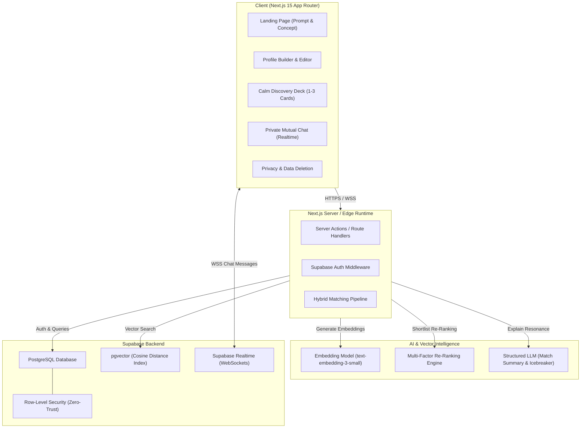
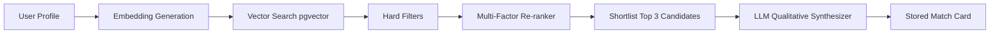

# Mindmate System Architecture & AI Pipeline Specification

This document details the system design, component hierarchy, hybrid AI matching algorithm, and privacy architecture for Mindmate.

---

## 1. High-Level Architecture Diagram



---

## 2. The Hybrid Matching Engine Pipeline

Mindmate deliberately avoids naive keyword matching and pure vector similarity ranking. Matching is executed via a multi-stage hybrid pipeline:



### Stage 1: Embedding Generation
- Whenever a user saves or edits their Curiosity Profile, the text is passed to an embedding model (`text-embedding-3-small`, 1536 dimensions).
- The vector is normalized and stored in the `profiles.profile_embedding` column.

### Stage 2: Fast Candidate Retrieval via `pgvector`
- An RPC function queries nearest neighbors using cosine distance (`<=>` operator):
  $$\text{Cosine Distance} = 1 - \frac{\mathbf{u} \cdot \mathbf{v}}{\|\mathbf{u}\|_2 \|\mathbf{v}\|_2}$$
- Top 50–100 candidate profiles are retrieved rapidly using an HNSW or IVFFlat index.

### Stage 3: Hard Rule Filtering
The candidate pool is pruned against strict invariants:
1. `profile.visibility == 'discoverable'` (exclude paused profiles).
2. Age criteria / eligibility checks.
3. Exclude self.
4. Exclude profiles where a match status already exists (`passed`, `requested`, `connected`, `unmatched`).
5. Exclude any blocked profiles in either direction.

### Stage 4: Multi-Factor Re-Ranking Formula
The remaining candidate pool is scored using a weighted multi-factor heuristic:

$$\text{Final Score} = w_1 S_{\text{semantic}} + w_2 S_{\text{conv\_style}} + w_3 S_{\text{complementary}} + w_4 S_{\text{timezone}} + w_5 S_{\text{freshness}}$$

Where:
- **$S_{\text{semantic}}$ (55%):** Raw cosine similarity of curiosity embeddings.
- **$S_{\text{conv\_style}}$ (15%):** Similarity in depth, tone, and pacing extracted from profile text.
- **$S_{\text{complementary}}$ (15%):** Complementary curiosity domain overlap (e.g. builder + thinker, questioner + experimenter).
- **$S_{\text{timezone}}$ (10%):** Practical timezone overlap for conversational viability ($\Delta \text{UTC} \le 4\text{h}$ receives highest score).
- **$S_{\text{freshness}}$ (5%):** Diversity bonus prioritizing profiles that haven't been over-suggested.

### Stage 5: Qualitative Resonance & Starter Question Synthesis
For the top 1–3 ranked candidates, a single structured LLM prompt is called:
- **Inputs:** Anonymized Profile A + Anonymized Profile B (no identifying info).
- **Outputs (JSON):**
  1. `resonance_summary`: One warm, human sentence explaining *why* they connect (e.g., *"You both return to making things, escaping shallow conversations, and finding small adventures in ordinary days."*).
  2. `shared_curiosity`: The common intellectual thread (e.g., *"Creative risk-taking in ordinary life"*).
  3. `first_question`: A thoughtful, open-ended question designed to start a genuine conversation (e.g., *"What would you try this year if you knew nobody would judge you for being a beginner?"*).
- **Crucial Rule:** The explanation is persisted in the database. It is **never** re-generated on subsequent renders.

---

## 3. Privacy & Consent Architecture

| Layer | Privacy Guarantee |
| :--- | :--- |
| **No Account Scraping** | Mindmate never asks for OpenAI credentials, OAuth tokens, or raw ChatGPT chat logs. The user copies a prompt and pastes only what they explicitly approve. |
| **Raw Profile Concealment** | Candidate users see only the high-level resonance summary, shared curiosity, broad city, and starter question. The full raw profile text is only revealed after both users accept the connection. |
| **No Creepy Compatibility Numbers** | Mindmate eliminates numerical scores ("98% match") to avoid reductionist matchmaking and preserve human authenticity. |
| **Zero-Trace Data Deletion** | When a user requests account deletion, a cascade deletes their profile, embeddings, matches, messages, and conversation records permanently. |
| **Row Level Security (RLS)** | Direct database access is gated by Postgres RLS: users can only read messages within conversations they belong to. |

---

## 4. Frontend Component Hierarchy

```text
app/
├── (marketing)/
│   └── page.tsx                   # Landing hero, 3-step guide, copyable prompt
├── onboarding/
│   ├── paste/page.tsx             # Curiosity profile text area & validation
│   └── review/page.tsx            # Name, age, city/timezone, preview & consent
├── (app)/
│   ├── discover/page.tsx          # 1-3 calm match cards with resonance explanations
│   ├── connections/page.tsx       # Pending requests & active matches
│   ├── chat/[id]/page.tsx         # Real-time private conversation
│   └── settings/page.tsx          # Pause discovery, edit profile, delete account
├── api/
│   ├── match/route.ts             # Matching trigger & candidate computation
│   └── profile/route.ts           # Profile CRUD operations
└── components/
    ├── ui/                        # Editorial buttons, cards, badges, inputs
    ├── prompt-copy-box.tsx        # One-click copyable ChatGPT prompt
    ├── match-card.tsx             # Individual calm resonance card
    └── chat-window.tsx            # Real-time messaging thread with icebreaker header
```
