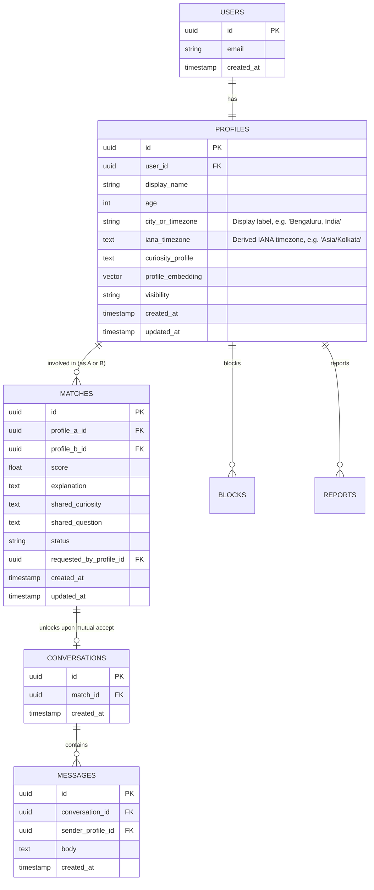

# Mindmate Database Schema & Migration Specification

This document provides the complete PostgreSQL database schema, `pgvector` indexing, Row-Level Security (RLS) policies, and stored procedures for Supabase.

---

## 1. Schema Diagram (ERD)



---

## 2. SQL DDL & Migration Code

```sql
-- 1. Enable Required Extensions
CREATE EXTENSION IF NOT EXISTS "uuid-ossp";
CREATE EXTENSION IF NOT EXISTS "vector";

-- 2. Profiles Table
CREATE TABLE public.profiles (
    id UUID PRIMARY KEY DEFAULT uuid_generate_v4(),
    user_id UUID REFERENCES auth.users(id) ON DELETE CASCADE NOT NULL UNIQUE,
    display_name VARCHAR(60) NOT NULL,
    age SMALLINT NOT NULL CHECK (age >= 18),
    city_or_timezone VARCHAR(100) NOT NULL, -- display label, e.g. "Bengaluru, India"
    iana_timezone TEXT,                     -- derived IANA timezone, e.g. "Asia/Kolkata" (migration 003)
    curiosity_profile TEXT NOT NULL CHECK (char_length(curiosity_profile) >= 50),
    profile_embedding VECTOR(1536), -- Compatible with text-embedding-3-small
    visibility VARCHAR(20) NOT NULL DEFAULT 'discoverable' CHECK (visibility IN ('discoverable', 'paused')),
    created_at TIMESTAMPTZ NOT NULL DEFAULT NOW(),
    updated_at TIMESTAMPTZ NOT NULL DEFAULT NOW()
);

-- Index for vector similarity search using cosine distance
CREATE INDEX IF NOT EXISTS idx_profiles_embedding_hnsw 
ON public.profiles 
USING hnsw (profile_embedding vector_cosine_ops);

-- Index for discoverability lookups
CREATE INDEX IF NOT EXISTS idx_profiles_visibility ON public.profiles(visibility);

-- 3. Matches Table
CREATE TABLE public.matches (
    id UUID PRIMARY KEY DEFAULT uuid_generate_v4(),
    profile_a_id UUID REFERENCES public.profiles(id) ON DELETE CASCADE NOT NULL,
    profile_b_id UUID REFERENCES public.profiles(id) ON DELETE CASCADE NOT NULL,
    score REAL NOT NULL DEFAULT 0.0,
    explanation TEXT NOT NULL,
    shared_curiosity TEXT NOT NULL,
    shared_question TEXT NOT NULL,
    status VARCHAR(20) NOT NULL DEFAULT 'suggested' 
        CHECK (status IN ('suggested', 'requested', 'connected', 'passed', 'unmatched')),
    requested_by_profile_id UUID REFERENCES public.profiles(id) ON DELETE SET NULL,
    created_at TIMESTAMPTZ NOT NULL DEFAULT NOW(),
    updated_at TIMESTAMPTZ NOT NULL DEFAULT NOW(),
    CONSTRAINT unique_profile_pair UNIQUE (profile_a_id, profile_b_id),
    CONSTRAINT different_profiles CHECK (profile_a_id <> profile_b_id)
);

CREATE INDEX IF NOT EXISTS idx_matches_profiles ON public.matches(profile_a_id, profile_b_id, status);

-- 4. Conversations Table (Created once match status is 'connected')
CREATE TABLE public.conversations (
    id UUID PRIMARY KEY DEFAULT uuid_generate_v4(),
    match_id UUID REFERENCES public.matches(id) ON DELETE CASCADE NOT NULL UNIQUE,
    created_at TIMESTAMPTZ NOT NULL DEFAULT NOW()
);

-- 5. Messages Table
CREATE TABLE public.messages (
    id UUID PRIMARY KEY DEFAULT uuid_generate_v4(),
    conversation_id UUID REFERENCES public.conversations(id) ON DELETE CASCADE NOT NULL,
    sender_profile_id UUID REFERENCES public.profiles(id) ON DELETE CASCADE NOT NULL,
    body TEXT NOT NULL CHECK (char_length(body) > 0 AND char_length(body) <= 4000),
    created_at TIMESTAMPTZ NOT NULL DEFAULT NOW()
);

CREATE INDEX IF NOT EXISTS idx_messages_conversation ON public.messages(conversation_id, created_at ASC);

-- 6. Blocks Table
CREATE TABLE public.blocks (
    id UUID PRIMARY KEY DEFAULT uuid_generate_v4(),
    blocker_profile_id UUID REFERENCES public.profiles(id) ON DELETE CASCADE NOT NULL,
    blocked_profile_id UUID REFERENCES public.profiles(id) ON DELETE CASCADE NOT NULL,
    created_at TIMESTAMPTZ NOT NULL DEFAULT NOW(),
    CONSTRAINT unique_block_pair UNIQUE (blocker_profile_id, blocked_profile_id)
);

-- 7. Reports Table
CREATE TABLE public.reports (
    id UUID PRIMARY KEY DEFAULT uuid_generate_v4(),
    reporter_profile_id UUID REFERENCES public.profiles(id) ON DELETE SET NULL,
    reported_profile_id UUID REFERENCES public.profiles(id) ON DELETE CASCADE NOT NULL,
    reason TEXT NOT NULL,
    created_at TIMESTAMPTZ NOT NULL DEFAULT NOW()
);
```

---

## 3. Stored Procedure for Candidate Vector Retrieval

```sql
CREATE OR REPLACE FUNCTION match_candidate_profiles(
    target_profile_id UUID,
    query_embedding VECTOR(1536),
    match_threshold FLOAT,
    match_count INT
)
RETURNS TABLE (
    id UUID,
    display_name VARCHAR,
    age SMALLINT,
    city_or_timezone VARCHAR,
    curiosity_profile TEXT,
    similarity FLOAT
)
LANGUAGE plpgsql
AS $$
BEGIN
    RETURN QUERY
    SELECT
        p.id,
        p.display_name,
        p.age,
        p.city_or_timezone,
        p.curiosity_profile,
        1 - (p.profile_embedding <=> query_embedding) AS similarity
    FROM public.profiles p
    WHERE p.id <> target_profile_id
      AND p.visibility = 'discoverable'
      AND p.profile_embedding IS NOT NULL
      -- Exclude profiles already in a match relationship
      AND NOT EXISTS (
          SELECT 1 FROM public.matches m
          WHERE (m.profile_a_id = target_profile_id AND m.profile_b_id = p.id)
             OR (m.profile_b_id = target_profile_id AND m.profile_a_id = p.id)
      )
      -- Exclude blocked users in either direction
      AND NOT EXISTS (
          SELECT 1 FROM public.blocks b
          WHERE (b.blocker_profile_id = target_profile_id AND b.blocked_profile_id = p.id)
             OR (b.blocker_profile_id = p.id AND b.blocked_profile_id = target_profile_id)
      )
      AND (1 - (p.profile_embedding <=> query_embedding)) > match_threshold
    ORDER BY p.profile_embedding <=> query_embedding
    LIMIT match_count;
END;
$$;
```

---

## 4. Row-Level Security (RLS) Policies

```sql
-- Enable RLS on all public tables
ALTER TABLE public.profiles ENABLE ROW LEVEL SECURITY;
ALTER TABLE public.matches ENABLE ROW LEVEL SECURITY;
ALTER TABLE public.conversations ENABLE ROW LEVEL SECURITY;
ALTER TABLE public.messages ENABLE ROW LEVEL SECURITY;
ALTER TABLE public.blocks ENABLE ROW LEVEL SECURITY;
ALTER TABLE public.reports ENABLE ROW LEVEL SECURITY;

-- Profiles: Users can view their own profile, or discoverable basic info of suggested matches
CREATE POLICY "Users can manage their own profile"
ON public.profiles FOR ALL
USING (auth.uid() = user_id);

-- Matches: Users can view matches they are part of
CREATE POLICY "Users can view matches they are part of"
ON public.matches FOR SELECT
USING (
    EXISTS (
        SELECT 1 FROM public.profiles p
        WHERE p.user_id = auth.uid()
          AND (p.id = profile_a_id OR p.id = profile_b_id)
    )
);

-- Messages: Users can only view and send messages in conversations they are members of
CREATE POLICY "Users can access messages for their conversations"
ON public.messages FOR ALL
USING (
    EXISTS (
        SELECT 1 FROM public.conversations c
        JOIN public.matches m ON c.match_id = m.id
        JOIN public.profiles p ON (p.id = m.profile_a_id OR p.id = m.profile_b_id)
        WHERE c.id = messages.conversation_id
          AND p.user_id = auth.uid()
          AND m.status = 'connected'
    )
);
```
