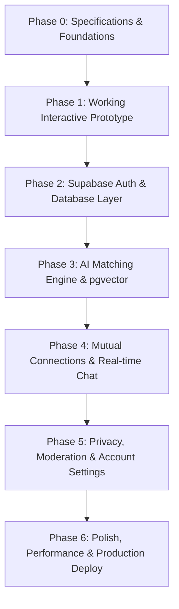

# 🗺️ Mindmate — Product & Engineering Roadmap

This document defines the complete phased engineering roadmap for building Mindmate. Each milestone is broken down into concrete deliverables, file structures, and acceptance criteria.

---

## 📊 Phase Overview

---

## 📌 Phase 0: Specifications & Foundations (Status: Completed)
- [x] Initialized Git repository.
- [x] Context & Architecture documentation created.
- [x] Agent handoff tracking system established.

---

## 📌 Phase 1: Working Interactive Prototype (Status: Completed)
**Goal:** Deliver a fully interactive, mobile-responsive client application with local state & seeded profiles to experience the full Mindmate user journey end-to-end.

### Tasks:
- [x] **1.1 Next.js 15 App Scaffold**
  - Next.js with TypeScript, Tailwind CSS, Lucide icons, and Tailwind Typography.
  - Custom font loading (*Newsreader* serif + *Inter* sans).
  - Setup custom color tokens in `tailwind.config.ts` (warm paper `#FAF8F5`, dark ink `#18181B`, coral `#E05A47`, sage `#5C7A68`).
- [x] **1.2 Shared Component Library**
  - Navigation bar with minimalist branding and status indicators.
  - Editorial button styles, textareas with live word/character counters.
  - Modal dialogs with smooth transitions.
- [x] **1.3 Page 1: Landing Page (`/`)**
  - Hero section: "Meet people through the questions they can't stop asking."
  - 3-step visual explanation: Prompt AI -> Paste & Review -> Meet a mind.
  - One-click copy Curiosity Profile prompt component with visual feedback.
  - Privacy promise banner: "Zero ChatGPT account access or history scraping."
- [x] **1.4 Page 2: Paste Profile (`/onboarding/paste`)**
  - High-focus editor with real-time length validation (90–130 words target).
  - "Need inspiration?" drawer with 8 diverse sample curiosity profiles.
  - Copy prompt button always accessible.
- [x] **1.5 Page 3: Profile Review & Details (`/onboarding/review`)**
  - Display name (nickname or first name).
  - Age selector (strictly 18+ validation).
  - Broad location / timezone selector.
  - Editable preview of the Curiosity Profile.
  - Explicit privacy statement.
- [x] **1.6 Page 4: Match Discovery (`/discover`)**
  - Calm 1–3 card view (anti-swipe, thoughtful layout).
  - Display card: Nickname, age, city/timezone, resonance summary, shared curiosity theme, suggested first question.
  - Actions: "I'd like to connect" and "Not for me / Pass".
  - Empty state when candidates are caught up.
- [x] **1.7 Page 5: Connections & Chat (`/connections` & `/chat/[id]`)**
  - Mutual connections list.
  - Clean private chat interface with suggested first question prominently pinned as conversation opener.
  - Simulated interactive response engine.
- [x] **1.8 Seed Dataset (`data/seed-profiles.ts`)**
  - 8 richly crafted, authentic curiosity profiles covering diverse intellectual crafts.

---

## 📌 Phase 2: Supabase Auth & Database Layer (Status: Completed)
**Goal:** Transition from local prototype state to persistent cloud storage with Supabase Authentication and PostgreSQL.

### Tasks:
- [x] **2.1 Database Migrations (`supabase/migrations/`)**
- [x] **2.2 Supabase Client Configuration**
- [x] **2.3 Authentication UI & Flow**
- [x] **2.4 Profile CRUD API**

> **Note:** Apply `supabase/migrations/001_initial_schema.sql` to your Supabase project to activate. Without env vars, the app continues in local demo mode.

---

## 📌 Phase 3: AI Matching Engine & Vector Search (Status: Planned)
**Goal:** Implement the hybrid matching algorithm combining vector semantic similarity, hard rules, multi-factor re-ranking, and LLM-generated resonance explanations.

### Tasks:
- [ ] **3.1 Embedding Generation Pipeline**
  - OpenAI `text-embedding-3-small` (1536 dimensions) or Google Gemini embedding service.
  - Background/Server action trigger on profile creation/update to generate and store vector embedding.
- [ ] **3.2 Candidate Retrieval (`pgvector`)**
  - Supabase RPC function `find_candidate_profiles` querying cosine distance `<=>`.
  - Hard filtering: age checks, active visibility (`discoverable`), exclude passed/blocked/connected profiles.
- [ ] **3.3 Hybrid Re-Ranking Algorithm (`lib/matching/reranker.ts`)**
  - Calculate combined resonance score:
    $$S = 0.55 \cdot S_{\text{semantic}} + 0.15 \cdot S_{\text{style}} + 0.15 \cdot S_{\text{complementary}} + 0.10 \cdot S_{\text{timezone}} + 0.05 \cdot S_{\text{freshness}}$$
- [ ] **3.4 Qualitative Resonance & Icebreaker Synthesizer (`lib/matching/synthesizer.ts`)**
  - Structured LLM prompt generating:
    1. One-sentence resonance summary (e.g., *"You both return to making things, escaping shallow conversations..."*)
    2. One thoughtful first-conversation starter question.
  - Store generated explanations in `matches` table to prevent re-querying on each page load.

---

## 📌 Phase 4: Mutual Connections & Real-time Chat (Status: Planned)
**Goal:** Safe, consent-driven mutual connections and real-time private messaging.

### Tasks:
- [ ] **4.1 Connection Request State Machine**
  - Handle `suggested` -> `requested` -> `connected` / `passed` states.
  - Notify recipient of incoming connection request (without revealing full raw profile until accepted).
- [ ] **4.2 Real-time Messaging (Supabase Realtime)**
  - WebSocket subscription to `messages` for active conversation.
  - Optimistic UI updates, delivery state, and typing indicators.
  - Shared first question displayed as conversation header.
- [ ] **4.3 Conversation Management**
  - Unmatch action (archives conversation and cleans match state).
  - Block & report dialogs with reason capture.

---

## 📌 Phase 5: Privacy Controls, Moderation & Settings (Status: Planned)
**Goal:** User safety, full data sovereignty, and compliance.

### Tasks:
- [ ] **5.1 Privacy & Visibility Settings**
  - "Pause Discovery" mode (temporarily hide profile from new match pools while keeping active chats).
  - "Delete Profile & All Data" (hard delete profile, embeddings, messages, and account).
- [ ] **5.2 Safety & Moderation Tools**
  - Automated toxicity / harassment scanning on messages.
  - Report handling endpoint and admin moderation views.

---

## 📌 Phase 6: Polish, Performance & Deployment (Status: Planned)
**Goal:** Production readiness, performance audit, and deployment on Vercel.

### Tasks:
- [ ] Responsive design audit across desktop, tablet, and mobile browsers.
- [ ] Dark mode / warm paper contrast accessibility check (WCAG AA).
- [ ] SEO metadata, Open Graph preview tags, and social cards.
- [ ] Production Vercel configuration and environment verification.
