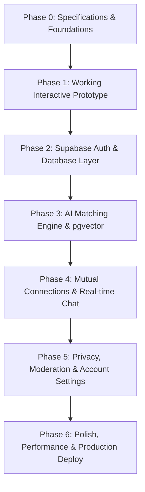

# Mindmate — Product & Engineering Roadmap

This document defines the complete phased engineering roadmap for building Mindmate. Each milestone is broken down into concrete deliverables, file structures, and acceptance criteria.

---

## Phase Overview

---

## Phase 0: Specifications & Foundations (Status: Completed)
- [x] Initialized Git repository.
- [x] Context & Architecture documentation created.
- [x] Agent handoff tracking system established.

---

## Phase 1: Working Interactive Prototype (Status: Completed)
**Goal:** Deliver a fully interactive, mobile-responsive client application with local state & seeded profiles to experience the full Mindmate user journey end-to-end.

### Tasks:
- [x] **1.1 Next.js 15 App Scaffold**
  - Next.js with TypeScript, Tailwind CSS, Lucide icons, and Tailwind Typography.
  - Custom font loading (*Newsreader* serif + *Inter* sans).
  - Setup custom color tokens in `tailwind.config.ts` (warm paper `#FAF8F5`, dark ink `#18181B`, coral `#E05A47`, sage `#5C7A68`).
- [x] **1.2 Shared Component Library**
  - Navigation bar with minimalist branding and status indicators.
  - Editorial button styles, textareas with live word/character counters.
  - Modal dialogs with smooth transitions.
- [x] **1.3 Page 1: Landing Page (`/`)**
  - Hero section: "Meet people through the questions they can't stop asking."
  - 3-step visual explanation: Prompt AI -> Paste & Review -> Meet a mind.
  - One-click copy Curiosity Profile prompt component with visual feedback.
  - Privacy promise banner: "Zero ChatGPT account access or history scraping."
- [x] **1.4 Page 2: Paste Profile (`/onboarding/paste`)**
  - High-focus editor with real-time length validation (90–130 words target).
  - "Need inspiration?" drawer with 8 diverse sample curiosity profiles.
  - Copy prompt button always accessible.
- [x] **1.5 Page 3: Profile Review & Details (`/onboarding/review`)**
  - Display name (nickname or first name).
  - Age selector (strictly 18+ validation).
  - Broad location / timezone selector.
  - Editable preview of the Curiosity Profile.
  - Explicit privacy statement.
- [x] **1.6 Page 4: Match Discovery (`/discover`)**
  - Calm 1–3 card view (anti-swipe, thoughtful layout).
  - Display card: Nickname, age, city/timezone, resonance summary, shared curiosity theme, suggested first question.
  - Actions: "I'd like to connect" and "Not for me / Pass".
  - Empty state when candidates are caught up.
- [x] **1.7 Page 5: Connections & Chat (`/connections` & `/chat/[id]`)**
  - Mutual connections list.
  - Clean private chat interface with suggested first question prominently pinned as conversation opener.
  - Simulated interactive response engine.
- [x] **1.8 Seed Dataset (`data/seed-profiles.ts`)**
  - 8 richly crafted, authentic curiosity profiles covering diverse intellectual crafts.

---

## Phase 2: Supabase Auth & Database Layer (Status: Completed)
**Goal:** Transition from local prototype state to persistent cloud storage with Supabase Authentication and PostgreSQL.

### Tasks:
- [x] **2.1 Database Migrations (`supabase/migrations/`)**
- [x] **2.2 Supabase Client Configuration**
- [x] **2.3 Authentication UI & Flow**
- [x] **2.4 Profile CRUD API**

> **Note:** Apply `supabase/migrations/001_initial_schema.sql` to your Supabase project to activate. Without env vars, the app continues in local demo mode.

---

## Phase 3: AI Matching Engine & Vector Search (Status: Live)
**Goal:** Implement the hybrid matching algorithm combining vector semantic similarity, hard rules, multi-factor re-ranking, and LLM-generated resonance explanations.

### Tasks:
- [x] **3.1 Embedding Generation Pipeline** (`lib/matching/embeddings.ts`)
  - Gemini `gemini-embedding-001` at `outputDimensionality: 1536` (free tier) by default; OpenAI
    `text-embedding-3-small` when only that key is set. Raw `fetch`, no SDK dependency either way.
  - Generated in `/api/profile` on create/update, only when the curiosity text changed. Non-fatal:
    a failure stores `null` rather than failing the save. `npm run backfill:embeddings` repairs them.
- [x] **3.2 Candidate Retrieval (`pgvector`)**
  - `match_candidate_profiles` RPC (cosine distance `<=>`, `SECURITY DEFINER`), extended in
    migration 005 to return `iana_timezone`, `is_demo` and `created_at`.
  - Hard filtering: discoverable only, self excluded, anyone with an existing match row in either
    direction excluded, blocks excluded in both directions.
- [x] **3.3 Hybrid Re-Ranking Algorithm (`lib/matching/reranker.ts`)**
  - $$S = 0.55 \cdot S_{\text{semantic}} + 0.15 \cdot S_{\text{style}} + 0.15 \cdot S_{\text{complementary}} + 0.10 \cdot S_{\text{timezone}} + 0.05 \cdot S_{\text{freshness}}$$
  - Semantic is real cosine similarity when embeddings are available; the keyword-overlap proxy
    remains only as the local-demo-mode fallback. Freshness is profile recency.
- [x] **3.4 Qualitative Resonance & Icebreaker Synthesizer (`lib/matching/synthesizer.ts`)**
  - Now actually reached (it had no callers before). Written once into `matches` at creation and
    never regenerated on render.

---

### Deferred: weak-match gating (turn on at ~10-15 active users)

Currently every retrieved candidate is shown. `SIMILARITY_THRESHOLD = 0.15` in
`app/api/match/route.ts` filters nothing in practice — measured cosine similarity between
two profiles with genuinely opposite worldviews is **0.78**, and well-matched pairs reach
**0.90**. The entire usable band sits far above the gate. This is expected: both texts are
"a person warmly describing their interests in ~100 words," and that shared register
dominates the vector more than the topics do.

The risk this creates is not a mediocre card, it is a *dishonest* one. Given an unrelated
pair the synthesizer reliably manufactures a plausible thread — a measured example produced
*"Discipline and Mastery: You both display a fierce dedication to disciplined creation and
mastery…"* for a slow-software bookbinder and a day-trading gym-goer. For a product whose
promise is explaining **why**, a confabulated why is worse than no match.

Gating is deliberately deferred because it is unaffordable at current scale. Simulated over a
48-profile pool spanning eight unrelated domains, the share of users whose best candidate
clears 0.86 (a genuine shared thread):

| users | 2 | 3 | 6 | 11 | 21 | 48 |
| :-- | :-- | :-- | :-- | :-- | :-- | :-- |
| hit rate | 52% | 73% | 92% | 97% | 99.5% | 100% |

At two users a gate empties the product for everyone; past ~10 it costs almost nothing
because nearly every user already has a good candidate. Best-match similarity itself only
climbs 0.861 → 0.897 across that range — the ceiling barely moves, the *floor* is what
improves.

**When active users pass ~10-15**, implement: add a `has_genuine_overlap` boolean to the
synthesizer's response schema, explicitly permit the model to decline, and skip candidates
it declines. Model judgement is preferred over a raw threshold because it self-calibrates as
the user base diversifies, and because a fixed number tuned on today's profiles will drift.
Raise `SIMILARITY_THRESHOLD` to ~0.78 at the same time, purely to avoid spending an API call
on hopeless pairs. The `/discover` empty state is already worded for this outcome.

Caveat for whoever picks this up: 0.86 was derived from measurement in one session, not
validated against human judgement. Once real matches exist, which cards actually felt
genuine is better evidence than that number.

---

## Phase 4: Mutual Connections & Real-time Chat (Status: Mostly delivered alongside Phase 3)
**Goal:** Safe, consent-driven mutual connections and real-time private messaging.

4.1 and 4.2 were pulled forward: a consent handshake needs a match row two sessions can share, which
is the same groundwork Phase 3 required, and leaving messages in `localStorage` beside a real
`conversations` row would have been incoherent.

### Tasks:
- [x] **4.1 Connection Request State Machine** (`app/api/matches/[id]/route.ts`)
  - `suggested → requested → connected / passed / unmatched`, validated server-side, invalid
    transitions rejected with 409.
  - Incoming requests surface on `/connections` with resonance and shared question only — the raw
    profile stays hidden until mutual acceptance.
- [x] **4.2 Real-time Messaging (Supabase Realtime)**
  - `postgres_changes` subscription filtered by `conversation_id`; messages merged by id so the
    POST response and the realtime event can't duplicate.
  - Match status is streamed too (migration 006): requests, acceptances and unmatches land
    without a refresh, across Discover, Connections and the navbar badges.
  - Shared first question pinned as the conversation header.
  - [ ] Still to do: delivery state and typing indicators.
- [ ] **4.3 Conversation Management**
  - [x] Unmatch action (`connected → unmatched`; the messages policy then locks the thread).
  - [ ] Block & report dialogs with reason capture — the `blocks` and `reports` tables and their RLS
        exist, but nothing writes to them. The chat overflow menu currently shows an `alert()` and
        unmatches instead.

---

## Phase 5: Privacy Controls, Moderation & Settings (Status: Planned)
**Goal:** User safety, full data sovereignty, and compliance.

### Tasks:
- [ ] **5.1 Privacy & Visibility Settings**
  - "Pause Discovery" mode (temporarily hide profile from new match pools while keeping active chats).
  - "Delete Profile & All Data" (hard delete profile, embeddings, messages, and account).
- [ ] **5.2 Safety & Moderation Tools**
  - Automated toxicity / harassment scanning on messages.
  - Report handling endpoint and admin moderation views.
- [ ] **5.3 Auth Abuse Prevention**
  - Cloudflare Turnstile (or hCaptcha) on the login form via Supabase's native CAPTCHA support — prevents email-bombing of magic links through our Resend quota.
  - Tighten Supabase Auth rate limits per email/IP for OTP requests.
  - Monitor Resend delivery dashboard for unusual send spikes.

---

## Phase 6: Polish, Performance & Deployment (Status: Planned)
**Goal:** Production readiness, performance audit, and deployment on Vercel.

### Tasks:
- [ ] Responsive design audit across desktop, tablet, and mobile browsers.
- [ ] Dark mode / warm paper contrast accessibility check (WCAG AA).
- [ ] SEO metadata, Open Graph preview tags, and social cards.
- [ ] Production Vercel configuration and environment verification.
